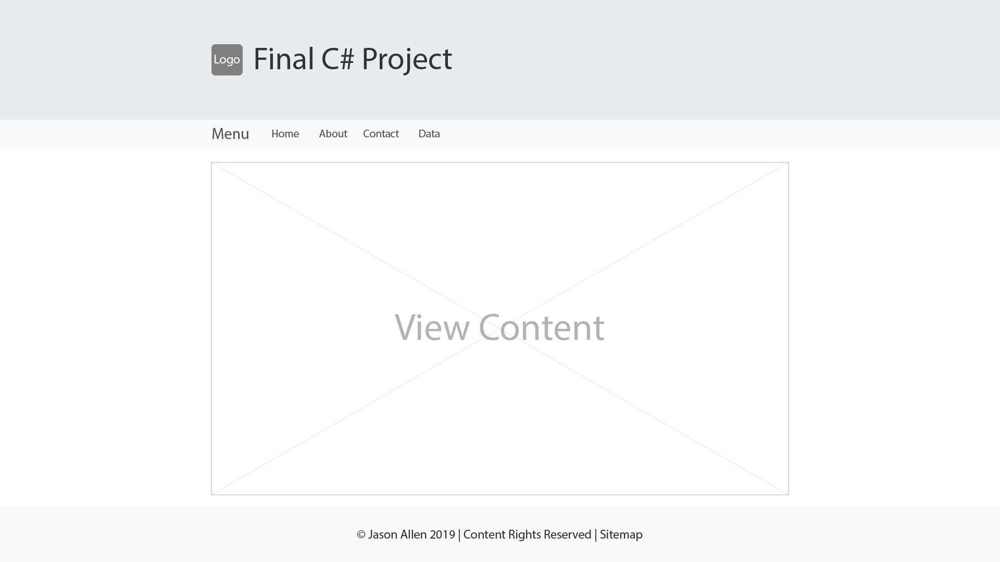
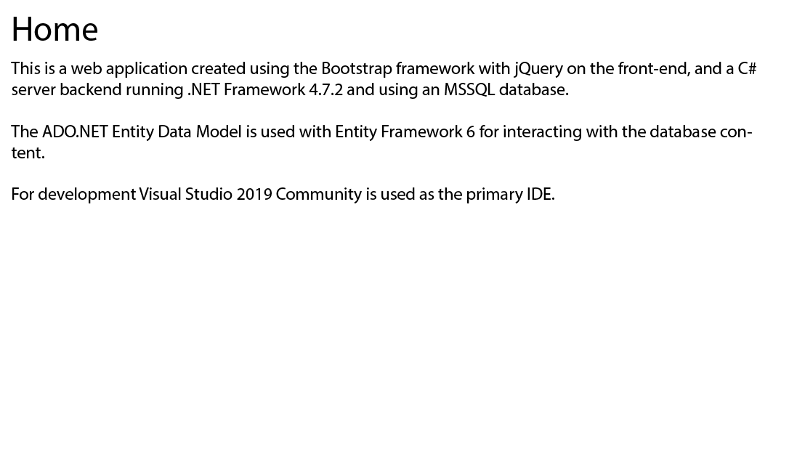
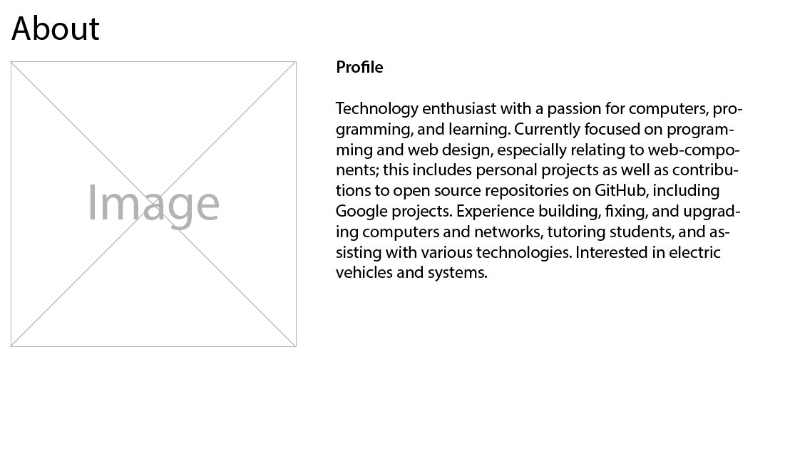
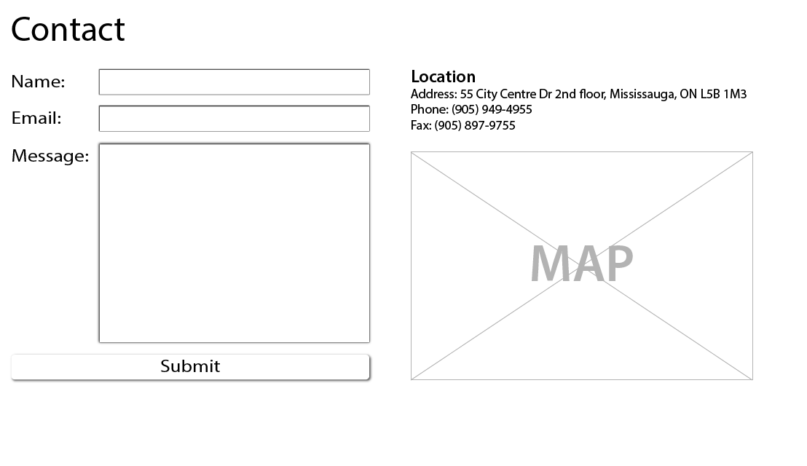
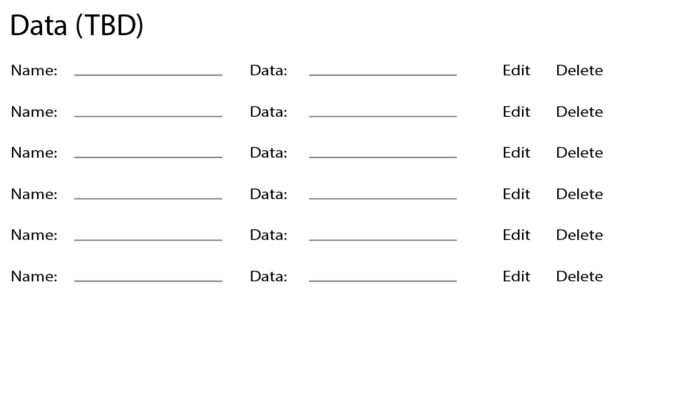

# C# Final Project

| Table of Contents                |
| -------------------------------- |
| [1. Outline](#outline)           |
| [2. Tools](#tools)               |
| [3. GUI Examples](#gui-examples) |

## Outline

This is a web application created using the Bootstrap framework with jQuery on the front-end, and a C# server backend running .NET Framework 4.7.2 and using an MSSQL database.

The ADO.NET Entity Data Model is used with Entity Framework 6 for interacting with the database content.

For development Visual Studio 2019 Community is used as the primary IDE.

## Tools

- [Visual Studio 2019 Community](https://visualstudio.microsoft.com/vs/)
- [.NET Framework 4.7.2](https://dotnet.microsoft.com/download)
- [Entity Framework 6](https://docs.microsoft.com/en-us/ef/ef6/)
- [Bootstrap](https://getbootstrap.com/)
- [jQuery](https://jquery.com/)

## GUI Examples

> Layout

> View - Home

> View - About

> View - Contact

> View - Data

